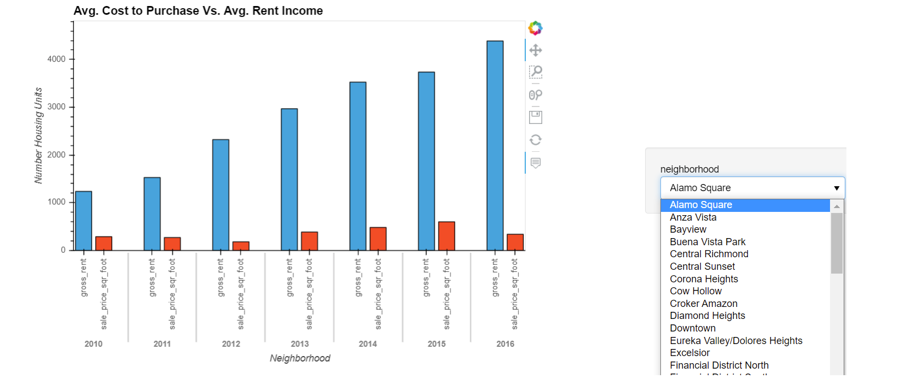
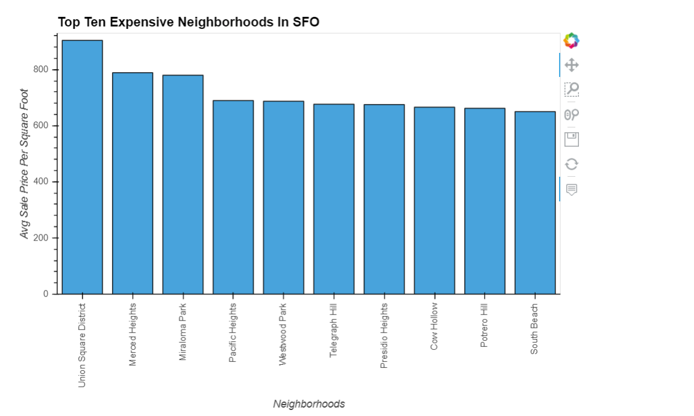
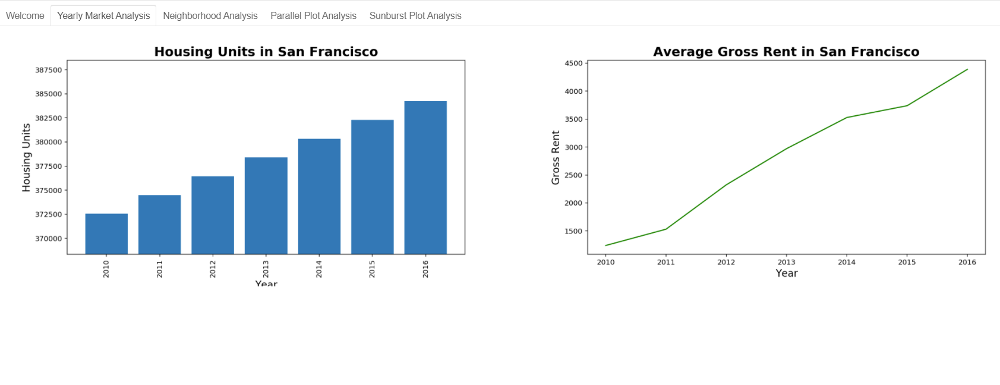

# Analysing the San Fransisco Housing Market
## Overview
In this notebook we use will use pandas to calculate the average sale prices and average rental cost for houses across different San Fransisco neighborhoods. Then we will us the `PyViz` ecosystmen to develop interactive visualizations. Finally, we will use `panel` to launch an interactive dashboard that will help us explore the data and determine if investing in San Fransisco properties can be profitable. 

### Average Sale Price Vs. Average Rent Income

### Top Ten Most Expensive Neighborhoods

### Dashboard

